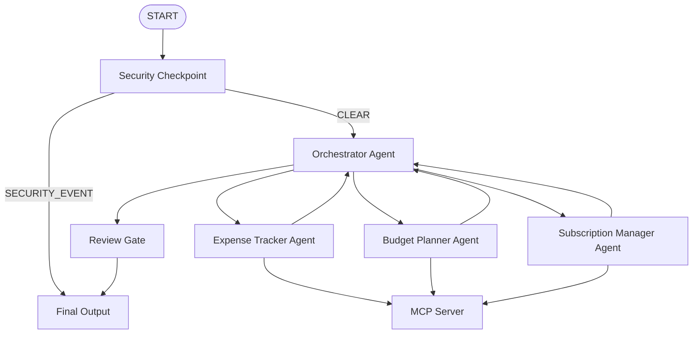
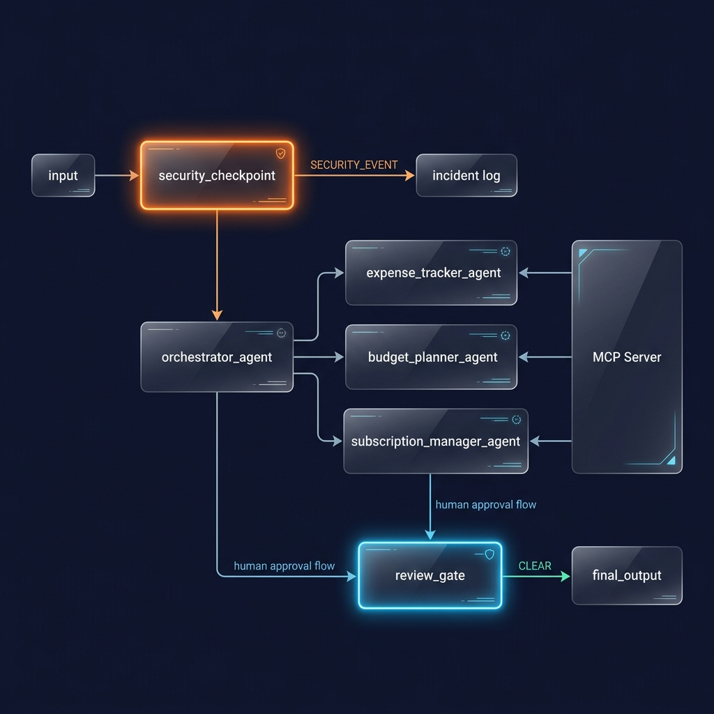

# Finance Concierge

An intelligent, secure, and multi-agent personal finance assistant that helps users track expenses, analyze budgets, and manage recurring subscriptions.

## Prerequisites

Before you begin, ensure you have:
- **Python 3.11 or higher**
- **uv**: Python package manager
- **Gemini API Key**: Get a key from [Google AI Studio](https://aistudio.google.com/apikey)

## Quick Start

1. Clone the repository:
   ```bash
   git clone https://github.com/harrish8248/finance-concierge.git
   cd finance-concierge
   ```

2. Copy the environment template and insert your API key:
   ```bash
   cp .env.example .env # Or verify .env contains GOOGLE_API_KEY
   ```

3. Install dependencies:
   ```bash
   make install
   ```

4. Launch the local development playground:
   - On macOS/Linux:
     ```bash
     make playground
     ```
   - On Windows:
     ```powershell
     uv run adk web app --host 127.0.0.1 --port 18081 --reload_agents
     ```

This will launch the interactive developer UI at http://localhost:18081.

---

## Architecture Diagram

The multi-agent workflow coordinates analysis across specialized sub-agents, protected by a security checkpoint and validated via a human-in-the-loop review gate.



---

## How to Run

- **Interactive Dev UI**: Starts the web playground at http://localhost:18081.
  - Windows: `uv run adk web app --host 127.0.0.1 --port 18081 --reload_agents`
  - macOS/Linux: `make playground`
- **FastAPI Web Server**: Runs the agent runtime app API on port 8090.
  - Command: `make run`
- **Run Tests**: Runs unit and integration tests.
  - Command: `uv run pytest tests/unit tests/integration`

---

## Sample Test Cases

Try sending these queries in the Playground UI to verify the agent's behavior:

### Test Case 1: Standard Expense & Budget Query
- **Input**: `"Show me my spending summary for this month and compare it to my budget."`
- **Expected Flow**:
  1. `security_checkpoint` runs, passes request as `CLEAR`.
  2. `orchestrator_agent` delegates to `expense_tracker_agent` and `budget_planner_agent`.
  3. Sub-agents call MCP tools `get_spending_summary` and `get_budget_limits`.
  4. Orchestrator synthesizes budget variance and gives savings recommendations.
- **Check**: You should see a detailed markdown table or JSON structure showing Food, Transport, and Entertainment actual spend vs. budget limits, indicating categories that are over/under budget.

### Test Case 2: High-Value Subscription cancellation (HITL Review Gate)
- **Input**: `"I want to cancel my Adobe CC subscription."`
- **Expected Flow**:
  1. Request is parsed as `CLEAR`.
  2. `orchestrator_agent` delegates to `subscription_manager_agent`.
  3. Since the subscription cost ($54.99) is greater than $50/month, the Orchestrator sets `requires_review = True`.
  4. `review_gate` pauses execution and displays a confirmation prompt.
- **Check**: The Playground UI will show a confirmation dialog box: `⚠️ Your Finance Concierge needs your approval: ... Do you approve this action?`. Selecting "yes" completes the action; selecting "no" cancels it.

### Test Case 3: Security Checkpoint Block (PII/Card Detection)
- **Input**: `"Check if there are any charges on card 4111 1111 1111 1111."`
- **Expected Flow**:
  1. `security_checkpoint` scans the request.
  2. Detects a raw unmasked 16-digit credit card number.
  3. Triggers the `SECURITY_EVENT` route immediately.
  4. Bypasses the Orchestrator and forwards to `final_output`.
- **Check**: The UI displays: `🚫 Request Blocked: Raw unmasked card number in request. Please mask sensitive data.` An audit log is printed to console logging: `{"event": "security_checkpoint", "severity": "CRITICAL", "raw_card_detected": true}`.

---

## Troubleshooting

1. **Error: `google.auth.exceptions.DefaultCredentialsError` / `Unable to find your project` during tests**
   - **Fix**: The integration tests run `AgentEngineApp` which initializes Vertex AI configuration. Ensure your local `.env` contains `GOOGLE_CLOUD_PROJECT=my-project` or check `tests/conftest.py` is loaded to mock authentication.
2. **Error: Playground fails with `Got unexpected extra arguments` on Windows**
   - **Fix**: PowerShell expands the `*` wildcard in some parameters. Run the Windows-specific playground start command instead of `make playground`:
     ```powershell
     uv run adk web app --host 127.0.0.1 --port 18081 --reload_agents
     ```
3. **Changes to code do not reload (Windows only)**
   - **Fix**: On Windows, the file watcher conflicts with the asyncio loop, disabling hot-reload. Stop the playground using:
     ```powershell
     Get-Process -Id (Get-NetTCPConnection -LocalPort 18081, 8090 -ErrorAction SilentlyContinue).OwningProcess | Stop-Process -Force
     ```
     And start the server fresh.

---

## Push to GitHub

1. Create a new repo at https://github.com/new
   - Name: `finance-concierge`
   - Visibility: Public or Private
   - Do NOT initialize with README (you already have one)

2. In your terminal, navigate into your project folder:
   ```bash
   cd finance-concierge
   git init
   git add .
   git commit -m "Initial commit: finance-concierge ADK agent"
   git branch -M main
   git remote add origin https://github.com/<your-username>/finance-concierge.git
   git push -u origin main
   ```

3. Verify `.gitignore` includes:
   ```
   .env          # your API key — must NEVER be pushed
   .venv/
   __pycache__/
   *.pyc
   .adk/
   ```

**Warning**: NEVER push your `.env` file containing the `GOOGLE_API_KEY` to GitHub.

---

## Assets

### Project Banner


### Agent Workflow Diagram


---

## Demo Script

A step-by-step presentation script is available in [DEMO_SCRIPT.txt](DEMO_SCRIPT.txt).
