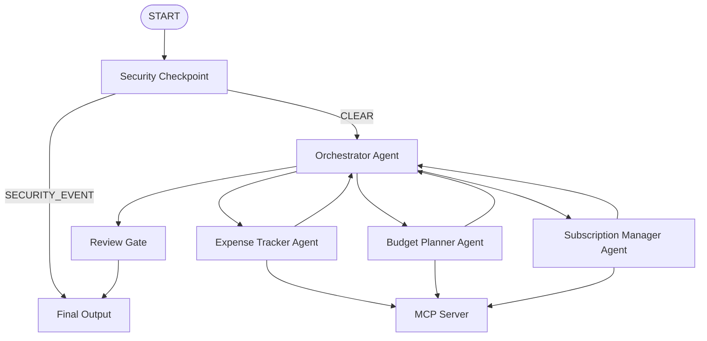

# Finance Concierge — Submission Write-Up

## Problem Statement

Managing personal finance can be overwhelming. Users struggle to keep track of fragmented spending across categories, identify upcoming subscription renewals, and maintain strict budgeting rules. Often, they lack the tools or the time to do rigorous transaction analysis, leading to unnecessary subscription charges and overspending.

At the same time, exposing financial requests to AI agents introduces security concerns. Users may inadvertently input sensitive Personally Identifiable Information (PII) like bank accounts, email addresses, or unmasked credit card numbers. Prompt injection attacks also pose a threat if malicious instructions are fed into the system via user queries or data sources.

**Finance Concierge** solves these challenges by providing a secure, multi-agent orchestrator that helps users manage their spending habits, track budgets, and control renewals under a strict security and human-in-the-loop validation system.

---

## Solution Architecture

The architecture consists of a central orchestrator delegating specific analysis to specialized sub-agents. These sub-agents query mock data using an Model Context Protocol (MCP) server running locally.

---

## Concepts Used

This project leverages key features of the **Agent Development Kit (ADK)** and the **Model Context Protocol (MCP)**:

1. **ADK 2.0 Workflow Graph**: Defined in [agent.py](app/agent.py#L314-L334) as `finance_concierge_workflow`. It coordinates nodes and decision routes using structured routing.
2. **Specialized LlmAgents**: Four sub-agents are declared in [agent.py](app/agent.py#L50-L164):
   - `expense_tracker_agent`: Categorizes expenses and flags high-value transactions.
   - `budget_planner_agent`: Compares actual spending against category limits.
   - `subscription_manager_agent`: Discovers subscriptions and tracks upcoming renewals.
   - `orchestrator_agent`: The central router coordinating sub-agent execution and synthesizing findings.
3. **AgentTool**: Utilized by the orchestrator in [agent.py](app/agent.py#L158-L162) to delegate questions dynamically to the specialized sub-agents.
4. **Model Context Protocol (MCP) Server**: Implemented in [mcp_server.py](app/mcp_server.py) using the Python MCP SDK. It exposes tools that are bound via `McpToolset` to the agents in [agent.py](app/agent.py#L38-L45).
5. **Security Checkpoint Node**: Placed as the mandatory root node of the graph in [agent.py](app/agent.py#L171-L249). It scrubs PII and checks for prompt injections.
6. **Agents CLI**: Scaffolded and maintained using `agents-cli`. Testing and local playground setups are integrated into the [Makefile](Makefile).

---

## Security Design

To secure user financial details, the **Security Checkpoint** implements the following rules:

- **PII Scrubbing**: Searches the input for credit cards, SSNs, bank accounts, phone numbers, and emails using custom regular expressions. Sensitive data is redacted before hitting the LLM (e.g. `[CARD-REDACTED]`).
- **Prompt Injection Blocking**: Scans for typical jailbreak keywords (e.g., `ignore previous instructions`, `DAN mode`). Detection instantly routes the request to a `SECURITY_EVENT` handler, blocking LLM processing.
- **Domain-Specific Constraints**: Restricts requests containing raw unmasked credit cards. If detected, the user request is immediately blocked, prompting them to redact details first.
- **Audit Logging**: Emits a structured JSON audit entry on every request, tracking redactions, input length, and warning/critical indicators.

---

## MCP Server Design

The MCP server runs over `stdio` and exposes four tools:

1. `get_spending_summary`: Returns spending grouped by category for a period.
2. `get_budget_limits`: Retrieves monthly budget limits.
3. `detect_recurring`: Identifies potential subscription charges based on transaction frequencies.
4. `get_upcoming_renewals`: Filters subscriptions renewing within the next N days.

These tools allow the agents to work with real-time financial datasets (mocked locally) in a structured manner.

---

## Human-in-the-Loop (HITL) Flow

A `review_gate` node is built into the workflow in [agent.py](app/agent.py#L250-L272).
If the user requests a high-value or irreversible action (e.g., cancelling a subscription costing >$50/month, or modifying budget limits), the `orchestrator_agent` sets `requires_review = True`.
The `review_gate` then pauses the pipeline and raises a `ctx.request_confirmation(...)` prompt. The workflow resumes only after the user manually approves or rejects the action in the playground.

---

## Demo Walkthrough

The workflow can be demonstrated via three primary scenarios:

1. **Category Spend Analysis**: The user asks for a spending report. The orchestrator delegates to the sub-agents, who call the MCP server, and summarizes the variances (e.g., Food is over-budget, Transport is under-budget).
2. **Adobe cancellation approval**: The user asks to cancel Adobe CC. The orchestrator identifies it costs $54.99/month, triggering the HITL review gate for manual approval.
3. **Card leakage block**: The user inputs a message containing raw card numbers. The security node intercepts it immediately, prevents LLM execution, prints a CRITICAL audit log, and outputs a block notification.

---

## Impact & Value Statement

The **Finance Concierge** bridges the gap between powerful financial planning and user safety. By combining a multi-agent structure with local database access via MCP and robust security checks, it empowers users to optimize their finances without compromising sensitive personal data.
